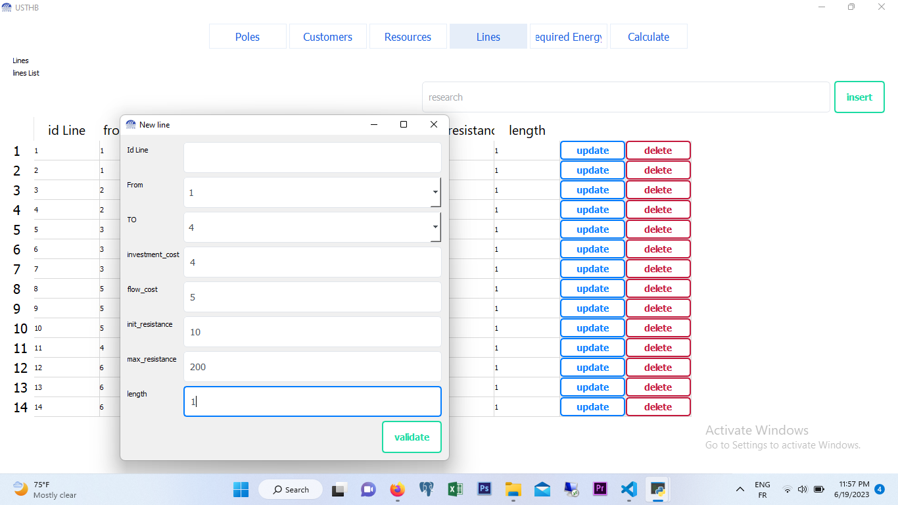

# electricity-network-optimization

## Environment

1. Install virtualenv:
```
pip install virtualenv
```
2. Create a virtual environment:
```
python -m  virtualenv env
```

3. Activate the virtual environment:
- On Windows:
  ```
  env\Scripts\activate
  ```
- On macOS and Linux:
  ```
  source env/bin/activate
  ```
## Installation

Install the required packages:
```
pip install -r requirements.txt
```
## Execution

Run the main script:
```
python main.py
```
## Build

Build the project:
```
python setup.py
```
## Installation File
Click [here]() to download the installation file.




